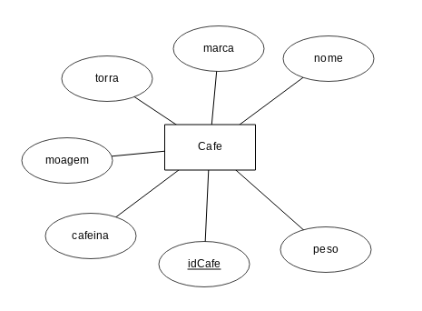
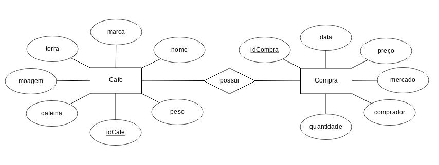
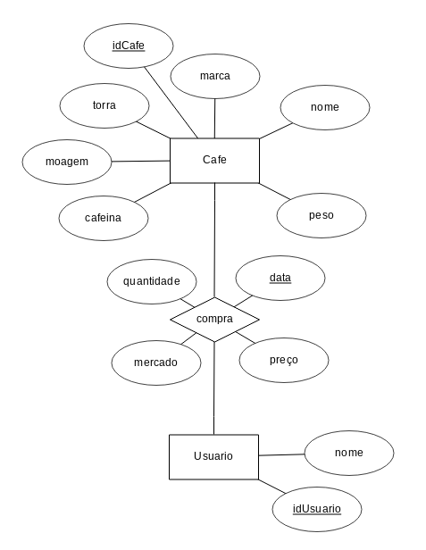

# Diagrama ER, identificadores, relacionamentos e cardinalidade

## Modelagem da entidade que representa um café com todas as suas características
----------------------
Atributos pensados: torra, marca, nome, moagem, cafeina, peso, _idCafe_
A entidade pode ser vista abaixo:

## Identificadores
----------------------
Outro identificador que podeira ser utilizado é o conjunto superchave {_moagem_, _nome_, _marca_}

Uma **chave** é um exemplo de superchave onde não seja possível retirar nenhum elemento sem perder a identificação da identidade. Uma **superchave** é qualquer conjunto, em excesso ou não, que identifica uma entidade. Dá-se o nome de **chaves candidatas** todas as chaves possíveis para a identificação de uma entidade.

## Relacionamentos
----------------------
Como exemplo de identificador, foi feita a entidade compra que descreve a compra de um café. Essa entidade se relaciona com a entidade cafe, e nela foram levantados os atributos: _idCompra_, comprador, data, preço e mercado. 
A entidade e a relação pode ser vista abaixo:

Uma versão melhor, inclusive, pode ser feita utilizando uma entidade Usuário para exemplificar atributos em relacionamentos. 

Algumas tuplas podem ser exemplificadas como (usuário, café, data): (1,1,data1), (1,1,data2), (2,1,data2), (3,2,data3)

## Cardinalidade
----------------------
Representa a permissibilidade da quantidade de entidades dentro de uma tupla de um relacionamento. Um aluno pode fazer muitos cursos, um usuário pode comprar muitos cafés, etc.

Exemplo do café com cardinalidades:

